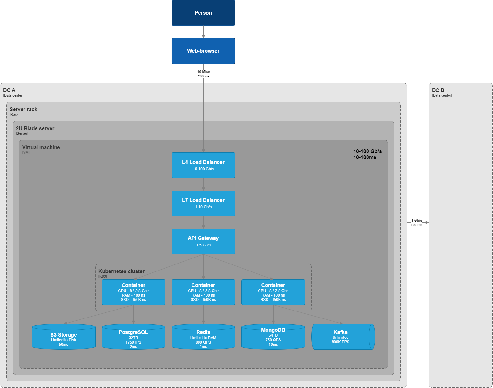

- [The prerequisites for this material](#the-prerequisites-for-this-material)
- [Latency Comparison Numbers](#latency-comparison-numbers)
  - [Time units](#time-units)
  - [Storage units](#storage-units)
- [Common characteristics](#common-characteristics)
  - [Throughput](#throughput)
    - [What causes low throughput](#what-causes-low-throughput)
    - [How to improve throughput](#how-to-improve-throughput)
  - [Latency](#latency)
    - [What causes latency](#what-causes-latency)
  - [Storage capacity](#storage-capacity)
  - [Connections](#connections)
- [Elements of a system](#elements-of-a-system)
- [Network](#network)
  - [Network elements throughput](#network-elements-throughput)
  - [Network elements latency](#network-elements-latency)
- [Data management](#data-management)
  - [Data management systems latency](#data-management-systems-latency)
  - [Data management systems throughput](#data-management-systems-throughput)
  - [Data management systems maximum storage capacity per item](#data-management-systems-maximum-storage-capacity-per-item)
  - [Data management systems maximum connections](#data-management-systems-maximum-connections)
- [Compute](#compute)
  - [Typycal datacenters server](#typycal-datacenters-server)
  - [Typycal datacenter rack numbers](#typycal-datacenter-rack-numbers)
- [Message brokers](#message-brokers)
  - [Message brokers throughput](#message-brokers-throughput)
- [Other architectural characteristics](#other-architectural-characteristics)
- [List of references](#list-of-references)

# The prerequisites for this material
During the system design process, it is important to have a good understanding of the system's capacity and performance. This is important because it helps to understand the system's limitations and to make sure that the system can handle the expected load.

There are several factors that can affect the capacity and performance of a system, such as the number of users, the amount of data, the type of data, the type of operations, the network bandwidth, the hardware, the software, and the system architecture.

In this material, we will discuss some of the common characteristics for essential elements of complex systems that are used for capacity and performance estimations during system design.

I have found general numbers for system design calculations, but i tryed to find more specific numbers for each element of the system. I will update this material as i find more specific numbers.

# Latency Comparison Numbers
Here are some basic numbers that are used for latency estimations during system design:

| Type of operation     | Latency |
| --------------------- | ------- |
| L1 cache reference    | 0.5 ns  |
| L2 cache reference    | 7 ns    |
| L3 cache reference    | 20 ns   |
| Main memory reference | 100 ns  |
| SSD storage read      | 150K ns |
| Disk seek             | 10ms    |
| HDD storage read      | 16 ms   |

## Time units
- 1 ns = 10^-9 seconds
- 1 us = 10^-6 seconds = 1,000 ns
- 1 ms = 10^-3 seconds = 1,000 us = 1,000,000 ns

## Storage units
- KB (Kilobyte) = 10^3 bytes
- MB (Megabyte) = 10^3 KB
- GB (Gigabyte) = 10^6 KB
- TB (Terabyte) = 10^9 KB
- PB (Petabyte) = 10^12 KB
- EB (Exabyte) = 10^15 KB

# Common characteristics
The following are some of the common characteristics that are used for capacity and performance estimations during system design:
- Throughput
- Latency
- Storage capacity
- Connections

## Throughput
Throughput is the number of operations that a system can handle per unit of time. It is usually measured in operations per second (ops/sec). Throughput is an important characteristic because it helps to understand how many operations a system can handle at a given time.

### What causes low throughput
- **Congestion** - just like road traffic is caused by many people trying to get to the same destination, low throughput in a software system can be caused by too many requests on the same network. 
- **Protocol overhead** - if the protocols used in message transmission require handshakes and other back-and-forth communication patterns, the network can be overloaded with overhead from just the protocols and not the message content itself.
- **Latency** - since throughput is the amount of data transmitted over a set time period, high latencies (i.e. slow data transmission speeds) will reduce the amount of data that is transmitted overall.

### How to improve throughput
- **Increasing bandwidth** - if you improve the capacity of a system to transport data (bandwidth), then the actual amount of data transferred (throughput) will increase too.
- **Improving latency** - since latency limits throughput, improving latency can improve throughput.
- **Protocol choice** - TCP has congestion avoidance features that can help mitigate congestion that causes low throughput.

## Latency
Latency is the time it takes for a system to respond to a request. It is usually measured in milliseconds (ms). Latency is an important characteristic because it helps to understand how fast a system can respond to a request.

### What causes latency
- **Physical distance**: the speed of light is the fastest anything can travel, so no matter how you design your system, transferring data through space will always take some time.
- **Complex computation**: if a computation is complex, it’s going to take longer to execute and increase latency. For example, a complex relational database query with lots of joins will take longer than a simple lookup by id. 
- **Congestion**: when there are many message requests coming in at once and the system doesn't have the capacity to process them all, some requests will have to wait, increasing latency. Either these requests will be dropped and sent again, or they'll sit in a queue waiting to be processed. 
- **Too many nodes**: if there are too many decision points in the pathway of a request, it will increase latency because each node along the way adds time while processing the request and deciding where to route it.

## Storage capacity
Storage capacity is the amount of data that a system can store. It is usually measured in kilobytes (KB), megabytes (MB), gigabytes (GB), terabytes (TB), petabytes (PB), or exabytes (EB).

## Connections
Connections are the number of concurrent connections that a system can handle. It is usually measured in connections per second (conn/sec). Connections are an important characteristic because they help to understand how many users a system can handle at a given time.

# Elements of a system
A system is composed of different elements that work together to provide a service. We need to keep in focus main parts of own system to make more precise calculations. Some of the common elements of a system include:
- Network
  - L4 Load balancer
  - L7 Load balancer
  - API Gateway
- Data management
  - Relational databases
  - NoSQL databases
  - Caching
  - Search engines
- Message brokers
  - Kafka
  - RabbitMQ
  - ActiveMQ
  - NATS
- Storage
  - Object storage
  - Block storage
  - File storage
- Compute
  - Typycal datacenters server
  - Typycal datacenter rack numbers
  
# Network
The network is the backbone of any system. It is responsible for transporting data between different components of the system. 
For system design calculations, it is important to consider the network bandwidth, latency. Let's take a look at the average numbers.

Most data centers are a mixture of 1-Gbit/sec and10-Gbit/sec structured cabling systems, with 1 Gbit/sec the prevalent data rate for most data link connections and 2 or 4 Gbits/sec for most storage link connections.

Geographically distributed data centers are connected by 10-Gbit/sec or 100-Gbit/sec links, with 10 Gbit/sec the prevalent data rate for most data center interconnects.

## Network elements throughput
Here are some average throughput numbers for different types of networks and network parts:

| Type of network | Value           |
| --------------- | --------------- |
| Datacenter      | 10 - 100 Gb/s   |
| Regional        | 100 - 1000 Mb/s |
| Global          | 10 - 100 Mb/s   |
| Mobile          | 1 - 10 Mb/s     |

| Part of system   | Value         |
| ---------------- | ------------- |
| L4 load balancer | 10 - 100 Gb/s |
| L7 load balancer | 1 - 10 Gb/s   |
| API Gateway      | 1 - 5 Gb/s    |

## Network elements latency
Here are some average latency numbers for different types of networks and network elements:

| Type of network  | Value     |
| ---------------- | --------- |
| Datacenter       | 1-10ms    |
| Regional         | 10-100ms  |
| Global           | 150-300ms |
| Mobile           | 100-500ms |
| L4 load balancer | 10-100ms  |
| L7 load balancer | 1-10ms    |
| API Gateway      | 1-10ms    |

# Data management
Data management systems are responsible for storing and managing data. They are used to store and retrieve data, perform complex read and write queries, and process transactions.
I will try to find overal specific numbers for several popular data management systems:
- Latency
- Throughput
- Storage capacity
- Maximum connections

This numbers was taken from several benchmarks. Used hardware is equal to AWS EC2 t2.2xlarge (8 cores, 32GB RAM, SSD).

## Data management systems latency
Latency is an important characteristic for data management systems because it helps to understand how fast a system can respond to a read or write request.

| Type of system       | Value |
| -------------------- | ----- |
| PostgreSQL           | 2ms   |
| MySQL                | 2ms   |
| MongoDB              | 10ms  |
| Cassandra            | 40ms  |
| Redis                | 1ms   |
| Cassandra            | 1-5TB |
| Elastic (indexing)   | 0.5ms |
| Elastic (searching ) | 150ms |
| S3                   | 50ms  |

## Data management systems throughput

| Type of system | Request type | Value    |
| -------------- | ------------ | -------- |
| PostgreSQL     | read         | 23000TPS |
| PostgreSQL     | write        | 1750TPS  |
| MySQL          | read         |          |
| MySQL          | write        |          |
| MongoDB        | read         | 750TPS   |
| MongoDB        | write        |          |
| Elastic        | indexing     | 22KEPS   |
| Elastic        | searching    | 1KEPS    |
| Redis          |              |          |

## Data management systems maximum storage capacity per item

| Type of system | Type     | Value                     |
| -------------- | -------- | ------------------------- |
| PostgreSQL     | Database | Unlimited                 |
| PostgreSQL     | Table    | 32TB                      |
| PostgreSQL     | Row      | 1.6 TB                    |
| MySQL          | Database | Unlimited                 |
| MySQL          | Table    | 256TB                     |
| MySQL          | Row      | 4GB                       |
| MongoDB        | Database | 64TB                      |
| Cassandra      | Node     | 1-5TB                     |
| Redis          | Database | Limited to amount of RAM  |
| S3             | Object   | 5TB                       |
| S3             | Store    | Limited to amount of disk |

## Data management systems maximum connections

| Type of system | Value  |
| -------------- | ------ |
| PostgreSQL     | 3000   |
| MySQL          | 2000   |
| MongoDB        | 1      |
| Cassandra      | 1      |
| Redis          | 32 768 |

# Compute
Compute is the process of executing code on a machine. It is responsible for running applications, processing data, and performing calculations. 

## Typycal datacenters server
2U Server with 8-core Intel Xeon CPUs, 2TB RAM, 24x 2TB SSDs, and 10Gbps Ethernet.

## Typycal datacenter rack numbers
Typycal datacenter rack is 48U rack with 24 servers, each with 2x 8-core Intel Xeon CPUs, 2TB RAM, 24x 2TB SSDs, and 10Gbps Ethernet.
- The overal calculation of computing is 24 servers * 2 CPUs * 8 cores = 384 cores.
- The total amount of RAM is 24 servers * 2TB = 48TB.
- The total amount of storage is 24 servers * 24 SSDs * 2TB = 1.152TB.
- The overal amount of network bandwidth is 24 servers * 10Gbps = 240Gbps.

| Type of resource | Value  |
| ---------------- | ------ |
| Units            | 48     |
| Servers          | 24     |
| CPU cores        | 400    |
| RAM              | 48TB   |
| SSD Storage      | 1PB    |
| LAN throughput   | 30Gb/s |

# Message brokers
Message brokers are responsible for routing messages between different components of a system. They are used to decouple the sender and receiver of a message, and to provide reliable message delivery.

## Message brokers throughput

| Type of broker | Value    |
| -------------- | -------- |
| Kafka cluster  | 800K RPS |
| RabbitMQ       | 40K RPS  |
| ActiveMQ       | 20K RPS  |
| NATS           | 1M RPS   |

# Other architectural characteristics
- **Availability**: the percentage of time that a system is operational and available to users. It is usually measured in percentage, such as 99.9% availability.
- **Scalability**: the ability of a system to handle an increasing amount of work or its potential to accommodate growth. It is usually measured in terms of how many users or requests a system can handle.
- **Reliability**: the ability of a system to perform its functions correctly and consistently under different conditions. It is usually measured in terms of mean time between failures (MTBF) and mean time to recovery (MTTR).
- **Security**: the protection of data and resources from unauthorized access, disclosure, alteration, destruction, or disruption. It is usually measured in terms of encryption, authentication, authorization, and auditing.

# List of references
- https://www-staging.loggly.com/blog/benchmarking-5-popular-load-balancers-nginx-haproxy-envoy-traefik-and-alb/
- https://cloudswit.ch/blogs/how-to-build-ultra-low-latency-data-center-networks/
- https://tyk.io/performance-benchmarks/
- https://terranet.io/dell/servernoe-oborudovanie?utm_term=%D1%81%D0%B5%D1%80%D0%B2%D0%B5%D1%80%D0%BD%D0%BE%D0%B5%20%D0%BE%D0%B1%D0%BE%D1%80%D1%83%D0%B4%D0%BE%D0%B2%D0%B0%D0%BD%D0%B8%D0%B5&etext=2202.7OwaHF4RX95XR5fLUuW7_U5KPrM9kEwDJWjrGRNIoS8oQzZ-MzOD1IxGi4-n-L_VyERwPME78WSvaOU0BXibL9mtBn2ypTKCBlU-KVkgmRmPioipNfffyXXOz_Rb16qOY3R6aW55dGFobW1saXd1bg.c59b58ca4283bc2d978c6507f7f8398042c151f1&yclid=16701417312560087039
- https://github.com/benstopford/awesome-db-benchmarks?tab=readme-ov-file
- https://servicestack.net/posts/bulk-insert-performance
- https://igotanoffer.com/blogs/tech/latency-throughput-availability-system-design-interview#throughput
- https://www.cri.ensmp.fr/classement/doc/E-428-slides.pdf
- https://www.postgresql.org/docs/current/limits.html
- https://dev.mysql.com/doc/mysql-reslimits-excerpt/8.0/en/limits.html
- https://www.educba.com/postgresql-max-connections/
- https://docs.aws.amazon.com/AmazonRDS/latest/UserGuide/MySQL.KnownIssuesAndLimitations.html#MySQL.Concepts.Limits.FileSize
- https://sysadminxpert.com/aws-rds-max-connections-limit/#How_to_manage_the_maximum_connections_limit_in_AWS_RDS
- https://medium.com/linux-academy/https-medium-com-claude-ducharme-aws-services-performance-benchmark-bbcf4e44c43
- https://www.researchgate.net/publication/337945603_Performance_Evaluation_of_Cassandra_Scalability_on_Amazon_EC2
- https://browser.geekbench.com/v6/cpu/1645974
- https://thenewstack.io/does-kubernetes-really-perform-better-on-bare-metal-vs-vms/
- https://www.elastic.co/blog/benchmarking-and-sizing-your-elasticsearch-cluster-for-logs-and-metrics
- https://davidlu1001.github.io/2020/01/23/ElasticSearch-Benchmark-with-Rally/
- https://developer.confluent.io/learn/kafka-performance/
- https://www.cri.ensmp.fr/classement/doc/E-428-slides.pdf
- https://programmersought.com/article/35775351566/
- https://github.com/ByteByteGoHq/system-design-101
- https://gist.github.com/jboner/2841832